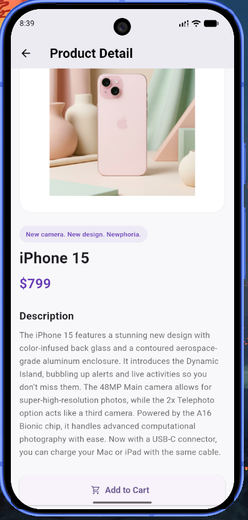
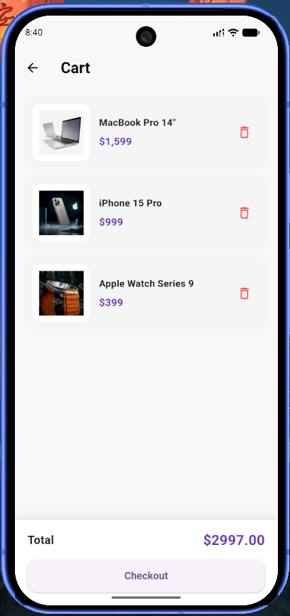
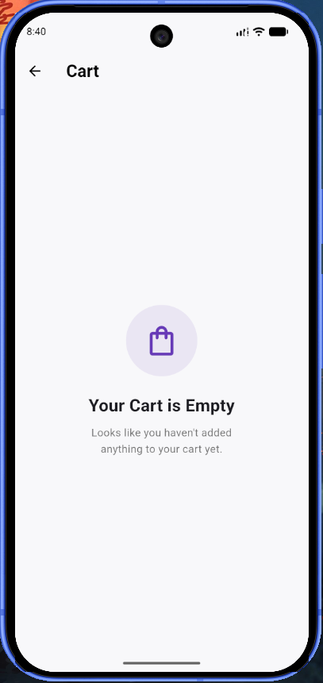

# 🛍️ Flutter Mini Catalog

Flutter kullanılarak geliştirilmiş modern bir mini katalog mobil uygulamasıdır.

Uygulama; ürünleri API üzerinden dinamik olarak listeleme, ürün arama, ürün detaylarını görüntüleme ve temel sepet işlemlerini gerçekleştirme özelliklerine sahiptir.

Bu proje, Flutter ve Dart kullanılarak mobil uygulama geliştirmenin temel yapılarını uygulamalı olarak göstermek amacıyla geliştirilmiştir.

---

## 📱 Proje Özellikleri

- 🏠 Modern ana sayfa
- 🔎 Ürün arama ve filtreleme
- 🛍️ GridView ile ürün listeleme
- 🖼️ Ürün görsellerini görüntüleme
- 📦 Ürün detay sayfası
- 🧭 Navigator ile sayfa geçişleri
- 🔗 Route Arguments ile sayfalar arasında veri taşıma
- 🛒 Sepete ürün ekleme
- 🗑️ Sepetten ürün silme
- 💰 Toplam sepet tutarı hesaplama
- 🛍️ Boş sepet ekranı
- 🌐 API üzerinden dinamik ürün verisi
- 🎨 Ortak uygulama teması
- 🧩 Yeniden kullanılabilir ProductCard widget'ı
- 📁 Düzenli proje klasör yapısı

---

## 🛠️ Kullanılan Teknolojiler

- **Flutter:** 3.47.6
- **Dart:** 3.13.5
- **Material 3**
- **Visual Studio Code**
- **Android Studio**
- **Android Emulator**

Projede ekstra Flutter paketi kullanılmamıştır.

---

## 🌐 Veri Kaynağı

Uygulamadaki ürün verileri eğitim ve demo amacıyla WANTAPI üzerinden alınmaktadır.

### Ürün API

```text
https://wantapi.com/products.php
```

### Banner Görseli

```text
https://wantapi.com/assets/banner.png
```

Bu kaynaklar gerçek bir e-ticaret altyapısını temsil etmemekte, API kullanımı, veri modelleme ve listeleme mantığını göstermek amacıyla kullanılmaktadır.

---

## 🏗️ Proje Mimarisi

Proje, sorumlulukların ayrı klasörlerde tutulduğu düzenli bir yapıya sahiptir.

```text
lib/
├── main.dart
│
├── models/
│   └── product.dart
│
├── pages/
│   ├── home_page.dart
│   ├── product_detail_page.dart
│   └── cart_page.dart
│
├── services/
│   ├── api_service.dart
│   └── cart_service.dart
│
├── widgets/
│   └── product_card.dart
│
└── theme/
    └── app_theme.dart
```

### 📂 Klasör Açıklamaları

#### `models/`

Uygulamada kullanılan veri modellerinin bulunduğu klasördür.

`Product` modeli API'den gelen ürün verilerini Dart nesnesine dönüştürmek için kullanılmaktadır.

#### `pages/`

Uygulamanın ana ekranlarını içerir.

- `home_page.dart` → Ana ürün listeleme ekranı
- `product_detail_page.dart` → Ürün detay ekranı
- `cart_page.dart` → Sepet ekranı

#### `services/`

Uygulamanın veri ve durum yönetimiyle ilgili servislerini içerir.

- `api_service.dart` → API'den ürünleri getirir.
- `cart_service.dart` → Sepet işlemlerini yönetir.

#### `widgets/`

Tekrar kullanılabilir özel widget'ların bulunduğu klasördür.

- `product_card.dart` → Ürün kartı bileşeni

#### `theme/`

Uygulamanın ortak tema ve tasarım ayarlarını içerir.

---

## 🔄 Veri Akışı

API'den alınan JSON verileri `Product.fromJson()` metodu ile `Product` modeline dönüştürülür.

```text
WANTAPI
   │
   ▼
JSON Response
   │
   ▼
Product.fromJson()
   │
   ▼
Product Model
   │
   ▼
ProductCard
   │
   ├── Ürün Detayı
   │
   └── Sepete Ekle
```

---

## 🧭 Sayfa Geçişleri

Uygulamada Flutter'ın Navigator yapısı kullanılmaktadır.

Ana sayfadan bir ürüne tıklandığında ürün bilgisi Route Arguments kullanılarak ürün detay sayfasına aktarılır.

```text
Ana Sayfa
    │
    │ Product
    ▼
Ürün Detay
    │
    ├── Sepete Ekle
    │
    └── Sepeti Görüntüle
            │
            ▼
          Sepet
```

---

## 🛒 Sepet Sistemi

Sepet işlemleri `CartService` üzerinden yönetilmektedir.

Kullanıcı:

- Ürünleri sepete ekleyebilir.
- Sepetteki ürünleri görüntüleyebilir.
- Ürünleri sepetten silebilir.
- Toplam sepet tutarını görüntüleyebilir.
- Sepet boş olduğunda özel boş sepet ekranını görebilir.

Sepet durumundaki değişikliklerin arayüze yansıtılması için Flutter'ın `ChangeNotifier` yapısı kullanılmaktadır.

---

## 🔎 Arama Sistemi

Ana sayfada bulunan arama alanı ile ürünler filtrelenebilmektedir.

Arama işlemi;

- Ürün adı
- Ürün sloganı
- Ürün açıklaması

üzerinden gerçekleştirilmektedir.

Arama işlemi büyük/küçük harf duyarlı değildir.

---

## 🎨 Kullanıcı Arayüzü

Uygulamada Material 3 tabanlı, sade ve modern bir kullanıcı arayüzü kullanılmıştır.

Tasarımda:

- Yuvarlatılmış ürün kartları
- Açık renkli arka plan
- Mor ana renk
- Ürün görselleri
- Modern butonlar
- GridView tabanlı ürün listesi
- Responsive yerleşim

kullanılmıştır.

---

## 📸 Ekran Görüntüleri

### 🏠 Ana Sayfa


---

### 📦 Ürün Detay



---

### 🛒 Sepet



---

### 🛍️ Boş Sepet



---

## 🚀 Kurulum ve Çalıştırma

### Gereksinimler

Projeyi çalıştırmak için aşağıdaki araçların kurulu olması gerekir:

- Flutter SDK
- Dart SDK
- Visual Studio Code veya Android Studio
- Android Emulator veya fiziksel Android cihaz

---

### 1. Repository'yi klonlayın

```bash
git clone https://github.com/meliksah-camgoz/flutter-mini-catalog.git
```

---

### 2. Proje klasörüne girin

```bash
cd flutter-mini-catalog
```

---

### 3. Flutter bağımlılıklarını yükleyin

```bash
flutter pub get
```

---

### 4. Bağlı cihazları kontrol edin

```bash
flutter devices
```

---

### 5. Uygulamayı çalıştırın

```bash
flutter run
```

---

## 🧪 Test Edilen Ortam

Proje geliştirme sırasında Android Emulator üzerinde test edilmiştir.

```text
Flutter: 3.47.6
Dart: 3.13.5
Platform: Android
```

---

## 📚 Kullanılan Flutter Yapıları

Projede Flutter'ın temel widget ve yapı taşlarından yararlanılmıştır:

- `MaterialApp`
- `Scaffold`
- `AppBar`
- `Column`
- `Row`
- `Container`
- `GridView`
- `ListView`
- `FutureBuilder`
- `Image.network`
- `TextField`
- `ElevatedButton`
- `OutlinedButton`
- `Navigator`
- `MaterialPageRoute`
- Route Arguments
- `ChangeNotifier`
- `AnimatedBuilder`

---

## 🎯 Proje Kazanımları

Bu proje kapsamında:

- Flutter proje yapısı
- Dart temel yapıları
- Widget ağacı
- Stateless ve Stateful yapıların kullanımı
- Sayfa geçişleri
- Navigator
- MaterialPageRoute
- Route Arguments
- JSON ve model yapısı
- `fromJson()` kullanımı
- Dinamik listeleme
- GridView
- Arama ve filtreleme
- Basit state güncelleme
- Sepet sistemi
- Proje klasörleme

konularında uygulamalı çalışma yapılmıştır.

---

## 👨‍💻 Geliştirici

**Melikşah Camgöz**

Computer Technology and Information Systems  
Bartın University

---


## 🔗 GitHub

[GitHub Repository](https://github.com/meliksah-camgoz/flutter-mini-catalog)
